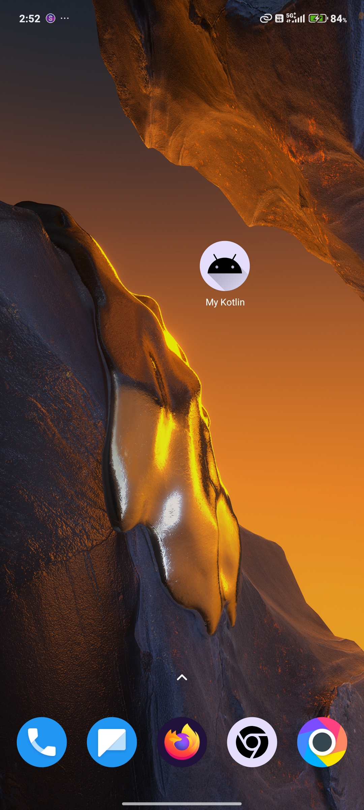
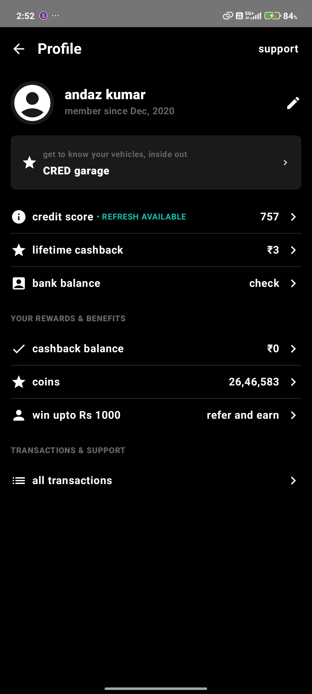

# MyKotlin Profile Screen

A modern Android Jetpack Compose UI for a profile screen, inspired by CRED's design.  
This project demonstrates the use of Material3, custom colors, and Compose best practices.

## Features

- Pure black background for a sleek, modern look
- Profile section with avatar, name, and edit button
- CRED Garage card with icon and navigation arrow
- Credit score, cashback, and bank balance cards
- Rewards & benefits section
- Transactions & support section
- Fully responsive and customizable

## Screenshots





## Demo Video


## Getting Started

1. **Clone the repository**
   ```sh
   git clone https://github.com/Mohmed-Husain/Profile-Activity-UI.git
   ```

2. **Open in Android Studio or VS Code**

3. **Run on Emulator or Device**
   - Make sure you have an Android emulator running or a device connected.
   - Use the following command to build and install:
     ```sh
     ./gradlew installDebug
     ```

4. **Open the ProfileScreen**
   - The main UI is in `app/src/main/java/com/<User>/mykotlin/screens/ProfileScreen.kt`.

## Dependencies

- Jetpack Compose
- Material3
- Kotlin

## Customization

- Change colors in the `ProfileColors` object.
- Update icons and text as needed.

---

**Author:**  
Mohmed Husain
